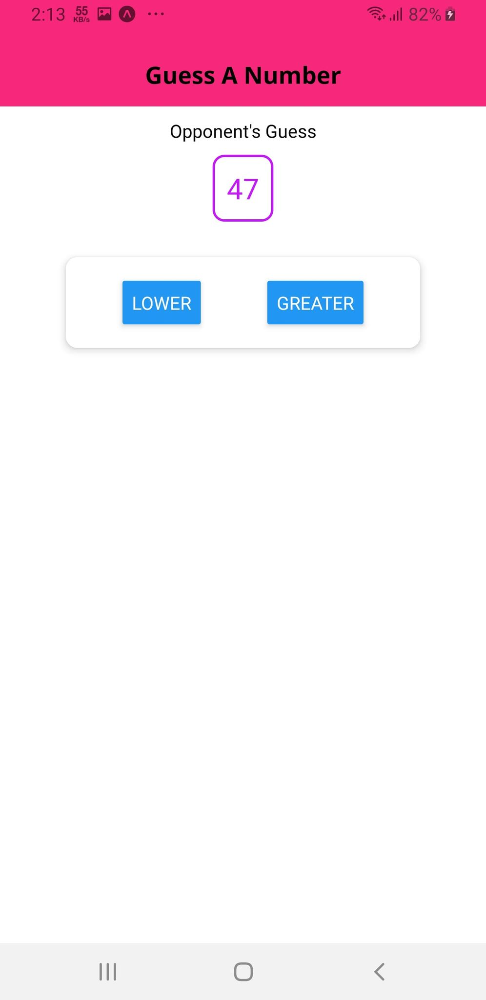

# Guess A Number
A simple game logic app designed with react-native expo for both Android and iOS platform.

<kbd></kbd> <kbd></kbd> <kbd></kbd>

# Reference
You can also learn from Udemy Course [www.udemy.com/course/react-native-the-practical-guide](https://www.udemy.com/course/react-native-the-practical-guide)
